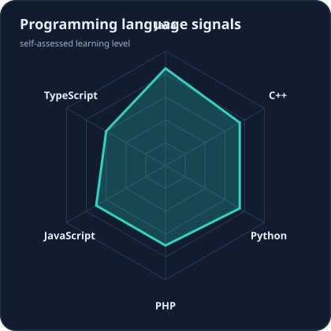
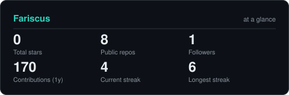
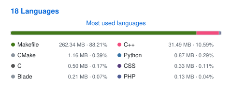
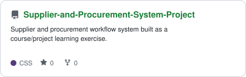
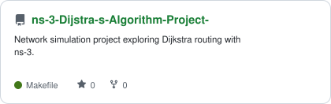
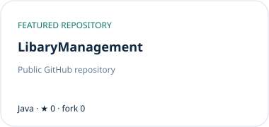

<div align="center">

<!-- BANNER — generated by scripts/banner/generate.py -->
<picture>
  <source media="(prefers-color-scheme: dark)"  srcset="assets/banner-dark.svg">
  <source media="(prefers-color-scheme: light)" srcset="assets/banner-light.svg">
  
</picture>

<br>

<!-- Animated tagline — width must fit the longest line (was clipping "Engineer") -->
<a href="https://github.com/Fariscus">
  
</a>

<br>

<a href="https://github.com/Fariscus"></a>

<br>


</div>

---

## This is me :)

Hi, I’m **Faris (Kris)** — a third-year Computer Science student at
**Paragon International University**, building toward a career in software engineering.

- Focused on **backend engineering**: APIs, databases, and services that stay understandable as they grow.
- Exploring **cloud and infrastructure** foundations — Docker, Linux, and the path toward AWS.
- Curious about **AI agents and LLM applications**, especially features that help real users.
- Learning by shipping projects, reading docs, and iterating — not by claiming mastery early.
- Always happy to talk about backend systems, student projects, and practical learning paths.

<br>

<div align="center">

## my perfect stack


<br>

<sub>Currently learning: Linux · AWS · Redis · CI/CD · System Design · Kubernetes · Distributed Systems · AI Agents</sub>

</div>

---

<div align="center">

## signals

<sub>Self-assessed learning levels — not professional proficiency claims.</sub>

<table>
<tr>
<td width="50%" align="center" valign="middle">

<!-- Edit data/skills.json — workflow redraws this chart -->
<picture>
  <source media="(prefers-color-scheme: dark)"  srcset="assets/radar-dark.svg">
  <source media="(prefers-color-scheme: light)" srcset="assets/radar-light.svg">
  
</picture>

</td>
<td width="50%" align="center" valign="middle">

<!-- Edit data/langmix.json -->
<picture>
  <source media="(prefers-color-scheme: dark)"  srcset="assets/radar-langs-dark.svg">
  <source media="(prefers-color-scheme: light)" srcset="assets/radar-langs-light.svg">
  
</picture>

</td>
</tr>
</table>

</div>

---

<div align="center">

## Numbers matter? ohhh yes.

<!-- Generated locally by scripts/cards.py from the GitHub API — no hardcoded stats -->
<picture>
  <source media="(prefers-color-scheme: dark)"  srcset="assets/card-stats-dark.svg">
  <source media="(prefers-color-scheme: light)" srcset="assets/card-stats-light.svg">
  
</picture>

<br>



</div>

---

<div align="center">

## featured projects

<sub>Real public repositories — edit <code>data/projects.json</code> to change the set.</sub>

<br>

<a href="https://github.com/Fariscus/Supplier-and-Procurement-System-Project">
  <picture>
    <source media="(prefers-color-scheme: dark)" srcset="assets/card-Supplier-and-Procurement-System-Project-dark.svg">
    <source media="(prefers-color-scheme: light)" srcset="assets/card-Supplier-and-Procurement-System-Project-light.svg">
    
  </picture>
</a>
<a href="https://github.com/Fariscus/ns-3-Dijstra-s-Algorithm-Project-">
  <picture>
    <source media="(prefers-color-scheme: dark)" srcset="assets/card-ns-3-Dijstra-s-Algorithm-Project--dark.svg">
    <source media="(prefers-color-scheme: light)" srcset="assets/card-ns-3-Dijstra-s-Algorithm-Project--light.svg">
    
  </picture>
</a>
<a href="https://github.com/Fariscus/LibaryManagement">
  <picture>
    <source media="(prefers-color-scheme: dark)" srcset="assets/card-LibaryManagement-dark.svg">
    <source media="(prefers-color-scheme: light)" srcset="assets/card-LibaryManagement-light.svg">
    
  </picture>
</a>

</div>

---

## current learning direction

```text
Backend Engineering
        ↓
   Spring Boot
        ↓
    REST APIs
        ↓
   PostgreSQL
        ↓
     Docker
        ↓
     Linux
        ↓
  AWS / Cloud
        ↓
  System Design
        ↓
  AI / AI Agents
```

This is my learning roadmap — not a claim of professional expertise.

---

<div align="center">

<sub>` building, learning, and shipping one project at a time · @Fariscus `</sub>

</div>
